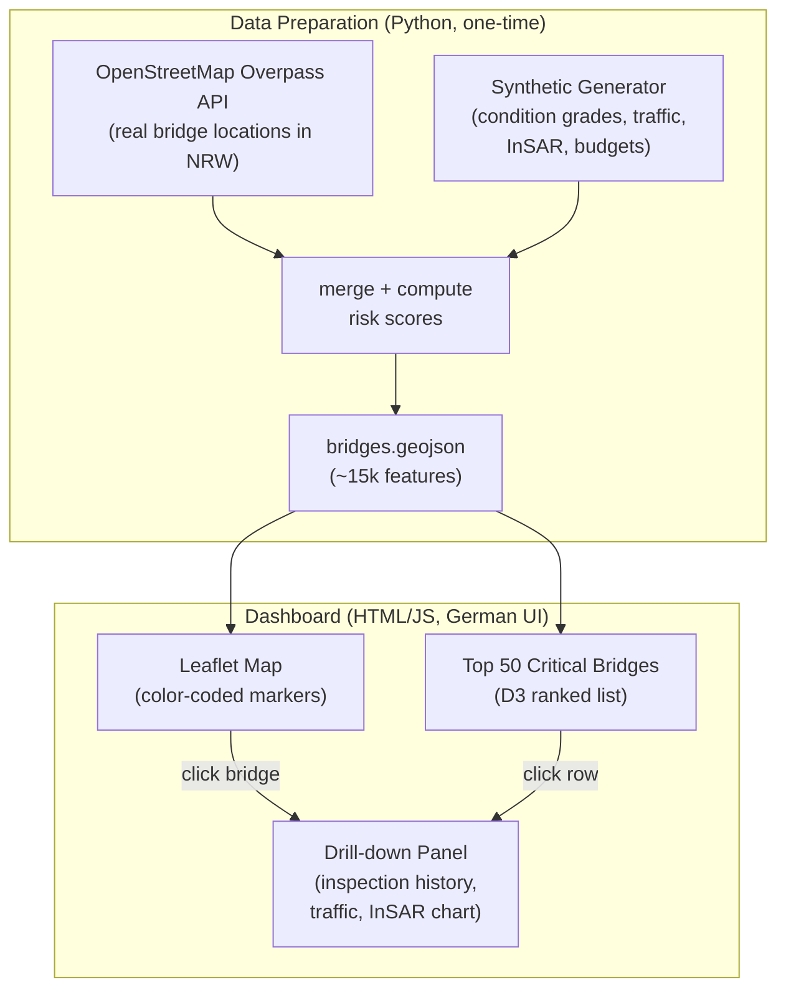

# NRW Bridge & Infrastructure Monitoring Dashboard

## Target Directory

`/Users/jcheng/Library/CloudStorage/OneDrive-trivagoN.V/Documents/nrw-bridge-dashboard/`

## Architecture Overview

A fully static site (no server required) -- open `index.html` in any browser or serve via `python -m http.server`. Ideal for stakeholder demos: just zip and send or host on GitHub Pages.




## Data Pipeline (Python script, run once)

### Step 1: Fetch real bridge locations from OpenStreetMap

- Use the Overpass API to query all `man_made=bridge` and `bridge=yes` nodes/ways within NRW's bounding box
- Extract: lat/lon, name (if available), road ref, span count (if tagged)
- Fallback: if Overpass returns fewer than ~10k results, supplement with highway bridges from NRW road network

### Step 2: Generate synthetic attributes for each bridge


| Field                                   | Generation Logic                                                        |
| --------------------------------------- | ----------------------------------------------------------------------- |
| `zustandsnote` (condition grade)        | Weighted random 1.0-4.0, skewed toward 2.0-2.5 (realistic distribution) |
| `baujahr` (construction year)           | Peak around 1965-1975, normal distribution                              |
| `tragfaehigkeit_tonnen` (load capacity) | Based on road class                                                     |
| `verkehr_dtv` (AADT traffic)            | Based on road class (Autobahn >> Kreisstrasse)                          |
| `bauwerk_typ` (structure type)          | Weighted: Spannbeton, Stahlverbund, Stahl, Stein                        |
| `insar_displacement_mm`                 | Time series (12 months), most near 0, ~5% show anomalous settlement     |
| `wirtschaftlicher_umweg_km`             | Random 2-80km based on road class                                       |
| `letzte_pruefung` (last inspection)     | Random date 2020-2025                                                   |


### Step 3: Compute composite risk score

```python
risk_score = (
    0.30 * normalize(zustandsnote) +
    0.20 * normalize(age_beyond_design_life) +
    0.20 * normalize(traffic_load_ratio) +
    0.15 * structural_redundancy_flag +
    0.15 * normalize(economic_detour_cost)
)
```

### Step 4: Export to GeoJSON

- Single `bridges.geojson` file with all properties embedded
- Separate `top50.json` for the ranked critical list
- Separate `bridge_details/{id}.json` for drill-down data (inspection timeline, InSAR chart data)

For performance with ~15k points, use clustered markers (Leaflet.markercluster) at low zoom levels.

## Dashboard (index.html)

### Layout (German UI)

```
+------------------------------------------------------------------+
| [K logo]  Bruckenmonitor NRW                    [Legend] [Filter] |
+------------------------------------------------------------------+
|                                    |  Top 50 Kritische Brucken   |
|          Leaflet Map               |  -------------------------   |
|    (NRW, color-coded bridges)      |  1. A1 Rheinbrucke Lev...   |
|                                    |  2. A40 Rheinbrucke Dui...  |
|                                    |  3. ...                     |
|                                    |  -------------------------   |
+------------------------------------------------------------------+
|  Bridge Detail Panel (on click)                                   |
|  Name | Zustandsnote | Baujahr | Verkehr | Risiko-Score          |
|  [Inspection History Chart]  [InSAR Displacement Chart]           |
+------------------------------------------------------------------+
```

### Key Features

- **Map**: Leaflet with OpenStreetMap tiles, bridges as circle markers colored by risk score (green 0-0.3, yellow 0.3-0.6, orange 0.6-0.8, red 0.8-1.0)
- **Marker clustering**: At low zoom, clusters show count + average risk color
- **Filters**: By road class (Autobahn, Bundesstrasse, etc.), condition grade range, construction decade
- **Top 50 list**: Sortable table with rank, name, road, risk score, condition grade
- **Detail panel**: Click a bridge to see inspection history (D3 line chart), InSAR displacement (D3 area chart), key facts card
- **Kanduit logo**: Top-left header, sourced from `assets/kanduit-logo.png`

### Libraries (all via CDN, no build step)

- Leaflet 1.9 + Leaflet.markercluster
- D3.js v7 (charts)
- Turf.js (optional, for geo calculations)

## File Structure

```
nrw-bridge-dashboard/
  README.md                  # English (public-sector value first)
  README.de.md               # German
  index.html                 # Dashboard (single-page app)
  css/
    style.css                # Dashboard styles
  js/
    app.js                   # Main app logic
    map.js                   # Leaflet map setup + clustering
    charts.js                # D3 chart components
    filters.js               # Filter controls
  data/
    bridges.geojson          # All ~15k bridges with properties
    top50.json               # Pre-computed top 50 list
  assets/
    kanduit-logo.png         # Kanduit "K" logo
    architecture-diagram.png # For README
  scripts/
    generate_data.py         # One-time data generation script
    requirements.txt         # Python deps (requests, geojson, numpy)
```

## READMEs

### Structure (same for both EN and DE)

1. **Hero section**: Kanduit logo + project title + one-line value prop
2. **The Problem** (2-3 paragraphs): Leverkusen bridge story, aging infrastructure crisis, fragmented data
3. **The Impact**: Cost of inaction (economic, safety, legal liability)
4. **Our Solution**: What the dashboard enables (prioritization, early warning, transparency)
5. **Key Metrics at a Glance**: Risk scoring explanation in plain language
6. **Live Demo**: Screenshot + instructions to open `index.html`
7. **Technical Architecture**: Databricks Lakehouse diagram, data sources table, medallion architecture (Bronze/Silver/Gold)
8. **Industry References**: DeepMind, Palantir, Delta Lake
9. **Data Sources**: Table from the user's screenshot
10. **Getting Started**: How to regenerate data + open dashboard

## Design Direction

- Clean, professional, government-appropriate aesthetic
- Dark header bar with Kanduit logo, light map area
- Color palette: NRW-inspired (green/white accents) with red-yellow-green risk encoding
- Typography: system fonts for speed, clear German-language labels
- Responsive: works on laptop screen for meeting room demos

